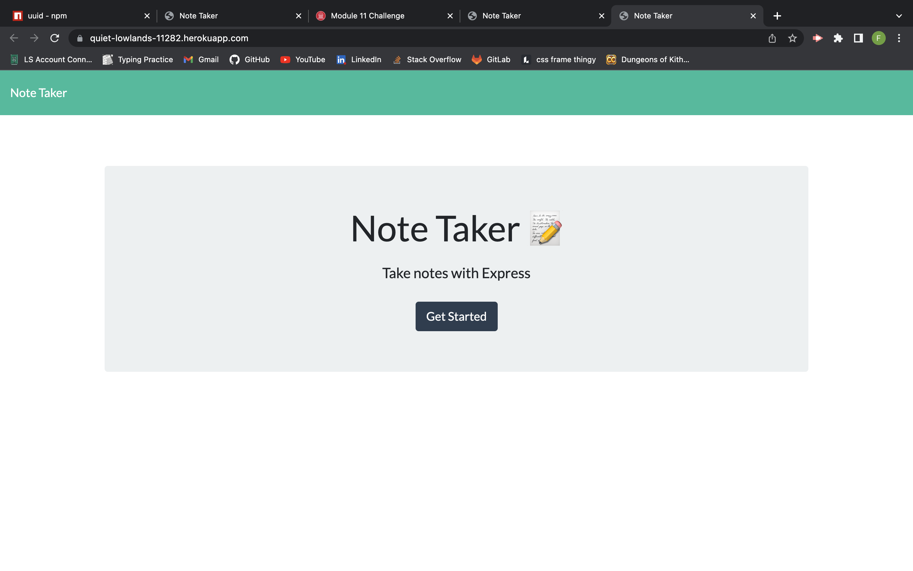

<!-- PROJECT LOGO -->
 

  

  <h1 align="center">Best Note APP ever!</h1>

<!-- ABOUT THE PROJECT -->
## About The Project

In today's fast paced world it is incredibly difficult to stay on top of everything. Not anymore! With this new technology you can not only write notes anywhere that you can open a web app but you can also save them and refer back to them in the future. I know what you're thinking "but there will be so many notes since I take them daily." WRONG, this web app comes with a built in DELETE function to help you stay clutter free! Now you have no excuse but to succeed!

(<a href="#readme-top">back to top</a>)

### Built With

### Installation

* Step 1: Clone repo
* Step 2: Make sure you have Node.js
* Step 3: use "npm i" to install the packages required

(<a href="#readme-top">back to top</a>)

<!-- USAGE EXAMPLES -->
## Usage
Once repo is cloned and node installed, open the the browser and go to http://localhost:3000/

(<a href="#readme-top">back to top</a>)

<!-- CONTRIBUTING -->
## Contributing

I am the only direct(instructors and tutor helped) contributer to this Repo.

(<a href="#readme-top">back to top</a>)

<!-- LICENSE -->
## License

(<a href="#readme-top">back to top</a>)

<!-- CONTACT -->
## Contact

Fabian Gutierrez - [fabiangutierrez580@gmail.com]
(LinkedIn) - [www.linkedin.com/in/fabian-gutierrez-016523248]

Project Link: [https://github.com/Guccierrez/BestNoteTakerApp]

<!-- ACKNOWLEDGMENTS -->
## Acknowledgments
Again shout out to My instructors, Mr. Edwards and Mr. Andrew.

<!-- MARKDOWN LINKS & IMAGES -->
